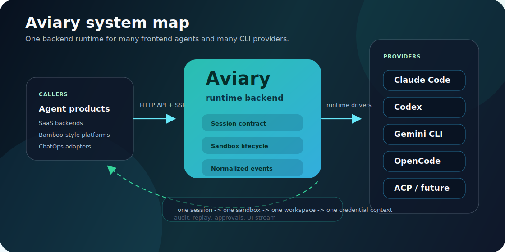
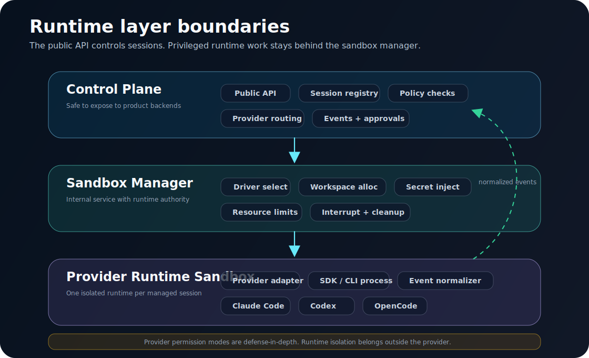
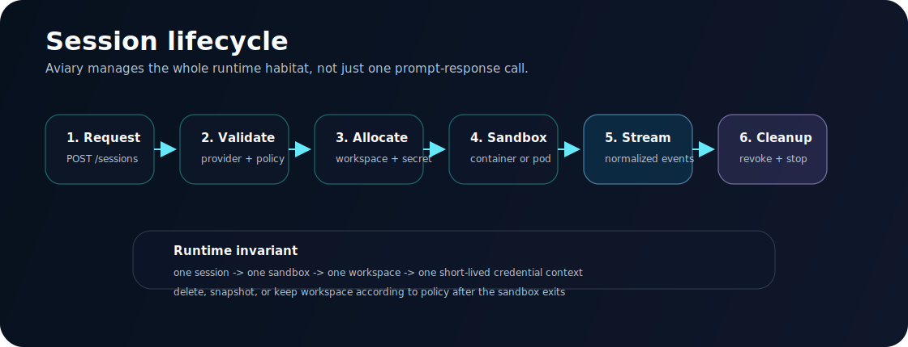

<h1 align="center">Aviary</h1>

<p align="center">
  <strong>面向 CLI Coding Agent 的自托管运行时后端。</strong>
</p>

<p align="center">
  当前支持 Claude Code，后续面向 Codex、Gemini CLI、OpenCode、ACP 兼容 Agent 和更多 Provider，
  通过一个 HTTP/SSE API 提供隔离工作区、策略控制、流式事件和私有化部署能力。
</p>

<p align="center">
  <a href="README.md">English README</a>
  ·
  <a href="#本地开发">本地开发</a>
  ·
  <a href="#架构">架构</a>
  ·
  <a href="#安全模型">安全模型</a>
  ·
  <a href="docs/product-design.md">设计文档</a>
</p>

<p align="center">
  <a href="https://www.python.org/"></a>
  <a href="https://docs.astral.sh/uv/"></a>
  <a href="#api-%E9%A2%84%E8%A7%88"></a>
  <a href="docs/sandbox-architecture.md"></a>
  <a href="LICENSE"></a>
</p>

<p align="center">
  
</p>

## Aviary 是什么？

Aviary 是给智能体产品、SaaS 后端、内部研发工具和 ChatOps 工作流使用的 Agent Runtime Backend。

它不是模型网关，也不是新的 Agent Framework。它做的是把不同 CLI Agent Provider 托管成可管理的运行时会话：

```text
一个会话 -> 一个沙箱 -> 一个工作区 -> 一组短期凭证上下文
```

Aviary 不是单一牢笼，而是一组受管理的隔离生境：不同 Provider、策略、工作区、模型网关和运行时 profile 可以共存在同一个后端 API 之后。

## 为什么需要 Aviary？

| | 如果你正在构建... | Aviary 提供... |
| --- | --- | --- |
| [API] | Coding Agent SaaS 后端 | Session、stream、interrupt、close、policy、provider routing API |
| [私有化] | 私有化 Agent 平台 | 自托管运行时控制和私有模型网关接入 |
| [Provider] | 多 Provider 智能体产品 | 通过 capabilities 暴露 Provider 支持程度，而不是硬编码假设 |
| [隔离] | 安全工作区运行环境 | 以每个会话为单位的工作区和凭证边界 |
| [事件] | 可观测 Agent UI | 标准化 SSE 事件，用于 UI 流式渲染、审计、回放和审批 |

## 当前状态

Aviary 还处于早期。核心运行时边界已经建立，但生产级 Docker/Kubernetes 沙箱 driver 仍在规划中。

| | 模块 | 状态 |
| --- | --- | --- |
| [完成] | FastAPI HTTP/SSE 服务 | 已实现 |
| [完成] | Claude Code Provider，基于 `claude-agent-sdk` | 已实现 |
| [完成] | 会话创建、查询、删除 | 已实现 |
| [完成] | SSE 消息流 | 已实现 |
| [完成] | Provider capabilities endpoint | 已实现 |
| [完成] | model/runtime/generation/policy/sandbox/provider_options DTO | 已实现 |
| [完成] | `SandboxDriver` 运行时边界 | 已实现 |
| [开发] | `LocalUnsafeSandboxDriver` | 已实现，仅开发使用 |
| [下一步] | 每个 session 一个 Docker container | 规划中 |
| [下一步] | Kubernetes pod/job driver | 规划中 |
| [下一步] | session/run/event/approval/audit 持久化 | 规划中 |
| [下一步] | Codex、Gemini CLI、OpenCode、ACP Provider | 规划中 |

## 本地开发

README 不是完整 API 手册。完整请求结构见 [docs/api-schema.md](docs/api-schema.md)，Claude Code Provider 映射见 [docs/claude-code-provider.md](docs/claude-code-provider.md)。

```bash
uv sync --extra dev
uv run pytest
uv run uvicorn aviary.main:app --reload --host 0.0.0.0 --port 9000
```

## 架构

<p align="center">
  
</p>

Aviary 拆出三个边界：

| 边界 | 负责 | 不应该负责 |
| --- | --- | --- |
| Control Plane | 公共 API、会话注册、策略校验、Provider 路由、事件持久化、审批状态 | Provider SDK 进程、Docker socket、原始密钥注入 |
| Sandbox Manager | 沙箱生命周期、工作区分配、资源限制、密钥投递、清理、interrupt/kill 升级 | 上层产品 API 语义 |
| Provider Runtime | Provider SDK 或 CLI 进程、Provider 参数映射、标准事件转换 | Host 工作区分配、授权判断、长期密钥管理 |

当前开发路径：

```text
FastAPI
  -> SessionManager
    -> LocalUnsafeSandboxDriver
      -> ClaudeCodeProvider
        -> claude-agent-sdk
```

`LocalUnsafeSandboxDriver` 的名字故意带有 unsafe，因为它会在 API 进程内运行 Provider adapter。它是开发模式，不是生产隔离方案。

## 会话生命周期

<p align="center">
  
</p>

Aviary 的核心不是一次 prompt-response，而是完整会话生命周期：策略校验、工作区分配、短期凭证注入、Provider Runtime 启动、标准事件流、中断、关闭和清理。

## API 预览

### Provider Capabilities

```http
GET /v1/providers
GET /v1/providers/{provider}/capabilities
```

Capabilities 用来告诉客户端某个 Provider 对字段的支持程度。比如 Claude Code 当前支持模型选择和 provider-specific options，但不直接支持 `temperature` 这类 generation control。

### 创建会话

```http
POST /v1/sessions
```

```json
{
  "provider": "claude-code",
  "conversation_id": "bamboo-conv-001",
  "model": {
    "name": "private-sonnet",
    "fallback": "private-haiku"
  },
  "runtime": {
    "base_url": "http://model-gateway:8080",
    "api_key_ref": "project-a/anthropic",
    "cwd": "/workspaces/project-a/bamboo-conv-001",
    "env": {}
  },
  "sandbox": {
    "profile": "default",
    "workspace_retention": "delete",
    "timeout_seconds": 1800
  },
  "policy": {
    "execution_mode": "approve_edits",
    "allowed_tools": ["Read", "Write"],
    "disallowed_tools": ["Bash"],
    "filesystem": "workspace_only",
    "network": "deny_by_default"
  },
  "provider_options": {
    "resume": "previous-claude-session-id",
    "max_turns": 5,
    "mcp_servers": {}
  },
  "metadata": {
    "external_trace_id": "trace-001"
  }
}
```

`metadata` 只能作为非权威关联信息。它不能作为鉴权依据、secret lookup key、workspace selector 或 provider option 来源。

### 流式消息

```http
POST /v1/sessions/{session_id}/messages:stream
```

返回 `text/event-stream`：

```text
event: start
data: {"type":"start","session_id":"...","data":{"provider":"claude-code"}}

event: ai_chunk
data: {"type":"ai_chunk","session_id":"...","data":{"content":"I will inspect the project..."}}

event: tool_call
data: {"type":"tool_call","session_id":"...","data":{"name":"Read","args":{"file_path":"README.md"}}}

event: end
data: {"type":"end","session_id":"...","data":{"provider_session_id":"..."}}
```

### 中断和关闭

```http
POST   /v1/sessions/{session_id}/interrupt
DELETE /v1/sessions/{session_id}
```

## 安全模型

安全模型要比 Provider 自带 permission mode 更严格：

- 公共 API 容器不能挂载 Docker socket。
- Provider runtime 不应该 privileged 运行。
- Host home、SSH keys、Git credentials、`~/.claude`、`~/.codex` 不能跨会话共享。
- 不接受来自终端用户 payload 的原始 Provider API Key。
- `runtime.api_key_ref` 应该解析到服务端 secret material。
- managed mode 下 workspace 应由服务端分配和校验。
- 网络策略默认 deny-by-default。
- 权限 bypass mode 不能作为默认行为。
- 生产使用前必须持久化事件和审计记录。

Provider 自带 sandbox flag 和 permission mode 只能作为 defense-in-depth。主安全边界应该由运行时沙箱承担。

## 部署模型

当前本地/API 容器：

```bash
docker build -t aviary .
docker run --rm -p 9000:9000 aviary
```

目标单机部署：

```text
api container
  -> internal sandbox manager container
    -> Docker Engine
      -> provider runtime container per session
```

目标 Kubernetes 部署：

```text
control plane deployment
  -> sandbox manager/controller
    -> pod or job per session
      -> network policy
      -> secret manager
      -> ephemeral or PVC-backed workspace
```

## 路线图

| | Milestone | Focus |
| --- | --- | --- |
| [当前] | `v0.1` | Claude Code proof of concept、local unsafe sandbox driver、SSE stream、memory storage |
| [下一步] | `v0.2` | durable event schema、persisted sessions/runs/events、policy validation |
| [下一步] | `v0.3` | Docker sandbox driver、workspace allocator、secret resolver、audit log |
| [后续] | `v0.4` | approval API、network/filesystem enforcement、Docker Compose |
| [后续] | `v0.5` | Codex provider、provider conformance tests |
| [后续] | `v1.0` | stable OpenAPI、SDK examples、Helm chart、production hardening guide |

## 文档

| | Document | Purpose |
| --- | --- | --- |
| [设计] | [Product Design](docs/product-design.md) | 产品边界、原则、路线图 |
| [Runtime] | [Sandbox Architecture](docs/sandbox-architecture.md) | Runtime 生命周期、Driver、隔离模型 |
| [API] | [API Schema](docs/api-schema.md) | DTO 分组和 Provider capability 模型 |
| [Provider] | [Claude Code Provider](docs/claude-code-provider.md) | Claude Agent SDK 映射和事件标准化 |

## 参与贡献

欢迎提交 issue 和 pull request。项目当前还在建立 Provider Runtime 边界，大型改动前建议先讨论设计。

## License

MIT
